  
  <h1 style="margin: 0;">WeiErLiTeo</h1>
  

    <b>Multilingual</b> -> <code>{ zh: 中文, en: English (Learning 学习中), ja: 日本語 (Learning 学习中) }</code>
  

  <h3 style="margin: 10px 0 5px 0;"> Contact me!</h3>
  
  
  

  <h3 style="margin: 10px 0 5px 0;"> Platforms I'm using now</h3>
  
  
  
    

  

  

  
🔢 <b>Special personal counters</b>

  

