  
  <h1>WeiErLiTeo</h1>

---

  <h2>📊 Statistics (English)</h2>
     
  
  

  
<b>点击查看中文版 | Click for Chinese Version</b>

  

    <h2>📊 数据统计 (中文)</h2>
    
  

  
<b>日本語版を表示 | Click for Japanese Version</b>

  

    <h2>📊 統計データ (日本語)</h2>
    
  

---

  <h3>📫 Contact Me</h3>
  
  

